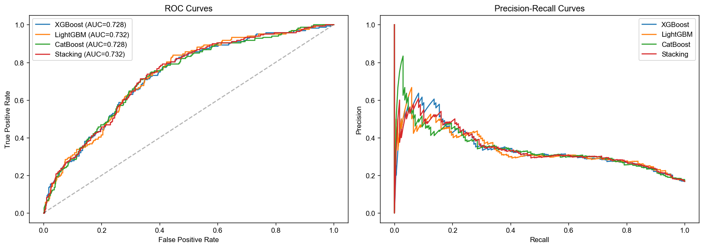
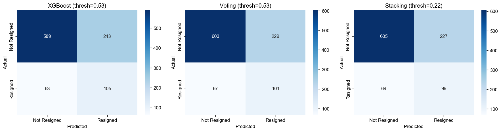
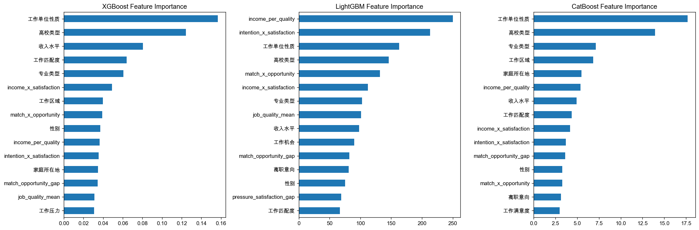
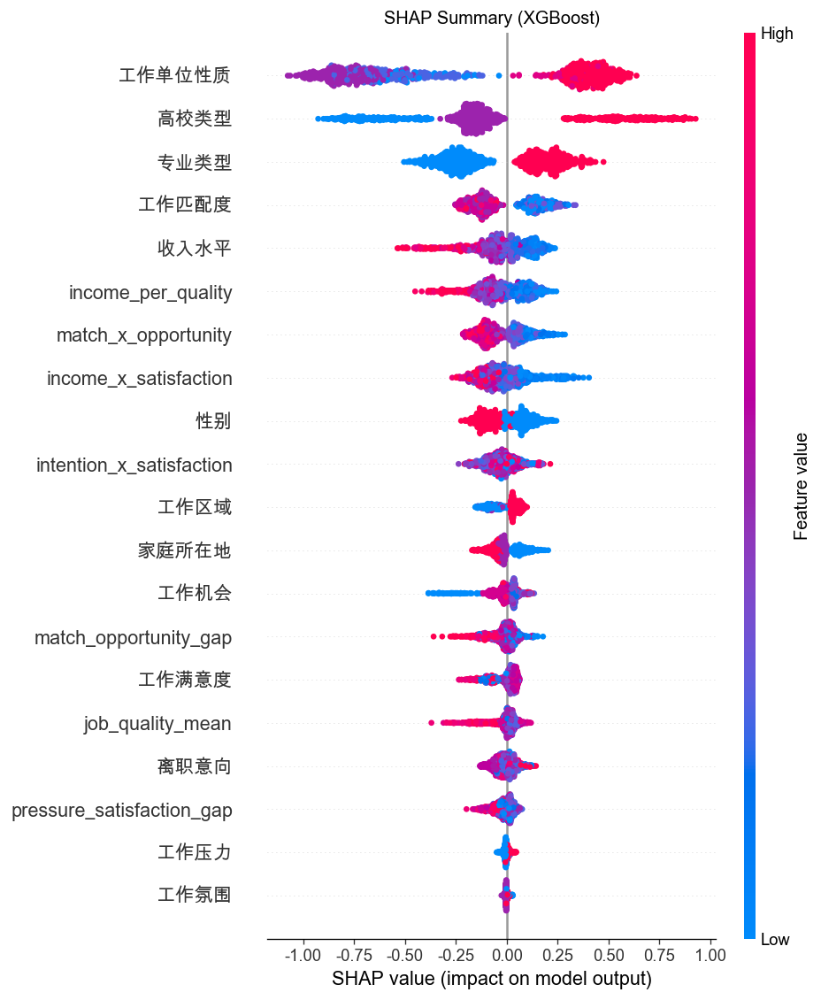

# 离职预测（Attrition Predictor）

本仓库基于问卷与行为数据，对 **离职行为**（二分类：0 = 未离职，1 = 离职）建模，并与 Liu et al. 2024 的 BORF 等基线对比。主流程见 `src/main.py` 与 `src/attrition_prediction.ipynb`。

---

## 数据集

| 项目 | 说明 |
|------|------|
| **主数据文件** | `data/处理之后的离职数据-5000.xlsx` |
| **样本量** | 约 5000 条 |
| **标签** | `离职行为`（0/1）；另有 `离职意向`（1–5）等字段 |
| **说明** | 原始数据与问卷材料放在 **`data/`**（见 `.gitignore`，**不随仓库推送到远端**；克隆后需自备数据或向维护者索取） |

**类别分布（概念）**：离职行为存在 **类不平衡**（负类远多于正类，比例与全样本文献中约 80/20 类似，以你本地 `value_counts()` 为准）。建模时需配合加权、阈值或采样策略，不宜单看整体准确率。

字段含义与整数编码见 **`docs/variable-labels.md`**（可与 `data/变量赋值说明.docx` 对照）。

---

## 建模结果图表（运行 `src/main.py` 后生成）

下列图片由脚本保存于 `src/`，便于在 README 中直接展示（若本地尚未运行，请先执行脚本生成）。

### ROC / Precision-Recall

整体区分能力（AUC）与不平衡下的精确率–召回权衡。



### 混淆矩阵（示例：XGBoost / Voting / Stacking）

不同集成方式在选定阈值下的分类结果对比。



### 特征重要性（三基学习器）



### SHAP 摘要（以 XGBoost 为例）



---

## 仓库结构

```
attrition-predictor/
├── README.md
├── docs/
│   ├── attrition_model_architecture.drawio   # 模型流程（draw.io）
│   ├── variable-labels.md                    # 变量与取值说明
│   └── …
├── data/                                     # 数据（gitignore，不提交）
├── src/
│   ├── main.py                               # 主训练与评估脚本
│   ├── attrition_prediction.ipynb
│   └── *.png                                 # 运行 main 后输出的图表
└── …
```

---

## 当前遇到的障碍与取舍（实践笔记）

1. **类不平衡下的指标冲突**  
   若一味追求 **整体准确率（Accuracy）**，模型容易偏向多数类，导致 **离职类召回 / F1** 变差；若以 **AUC** 为主优化排序能力，在 **未单独调阈值** 时，**Accuracy** 未必同时最优。建议：**先明确业务更怕漏判离职还是误报，再选定主指标（如正类 F1、PR-AUC、或带成本的阈值）**，不宜同时把 Accuracy 与 AUC/F1 都当作唯一目标。

2. **过采样（如 SMOTE）的两面性**  
   在 **整数编码的类别特征** 上合成少数类样本，可能引入 **不真实的组合**，表现为指标波动或变差；而论文中的 **CTGAN** 等生成式过采样与简单 SMOTE 假设不同，复现时需对照说明。当前经验是：**调参阶段与最终评估的采样/阈值策略要一致**，并记录是否使用 SMOTE。

3. **阈值 vs 概率校准**  
   树模型输出的概率未必校准；**0.5 未必合适**。实践中常在验证集上按 **F1、Youden J** 或业务成本选阈值；若更换训练分布（如过采样），**默认 0.5 的含义会变化**，需要同步调整阈值策略。

4. **可复现与数据不可公开**  
   数据未入库时，README 仅能描述变量与流程；对外展示需依赖 **脱敏统计或上述图表**，并注明随机种子与划分方式（如 `train_test_split` 分层比例、`random_state`）。

---

## 参考与基线

- 基线指标见 `src/main.py` 中 `PAPER_BENCHMARK`（含 BORF：Accuracy、离职类 Precision/Recall/F1、AUC 等）。
- 更完整的文献与变量说明见 `docs/` 下材料。

---

## 快速运行（需本地已有 `data/` 下 Excel）

```bash
pip install -r requirements.txt
cd src && python main.py
```

依赖见项目根目录 **`requirements.txt`**（含 `imbalanced-learn` 等；若脚本使用 SMOTE 则需该包）。
