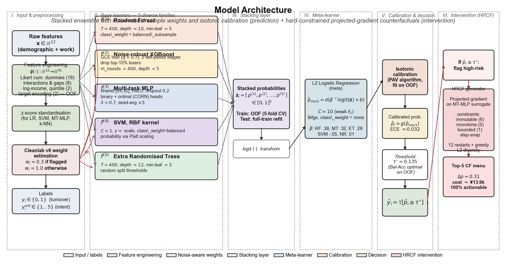
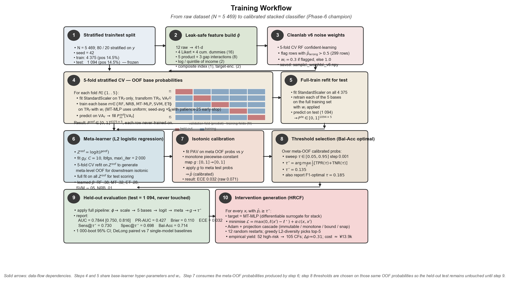

# 3 · Methods

> 本章对模型的训练与推断流程做逐步形式化描述，对应 `src/07_stack_v5.py`、`src/06a_features.py`、`src/06b_cleanlab.py`、`src/02a_hrcf_algo.py` 四个核心脚本。架构概览见 **Fig. M1**，完整训练流程见 **Fig. M2**。



**Fig. M1**　System architecture. The prediction pathway (columns I–V) produces a calibrated probability $\hat p$ and a hard-thresholded decision $\hat y$; the intervention pathway (column VI) converts high-risk predictions into actionable counterfactual menus via HRCF.

---

## 3.1 Problem formulation & notation

设训练集 $\mathcal{D}_{\mathrm{tr}} = \{(\mathbf{x}_i, y_i, y_i^{\mathrm{ord}})\}_{i=1}^{N_{\mathrm{tr}}}$，其中：

- $\mathbf{x}_i \in \mathbb{R}^{12}$ 为 12 维原始特征（人口统计 + 工作特征），见 `docs/variable-labels.md`；
- $y_i \in \{0,1\}$ 为**主标签**「离职行为」；
- $y_i^{\mathrm{ord}} \in \{1,2,3,4,5\}$ 为**辅助标签**「离职意向」，仅在训练阶段供 MT-MLP 作多任务监督，**推断阶段不读取**。

目标一：学习 $\hat p: \mathbb{R}^{12} \to [0,1]$ 与校准阈值 $\tau^\star$，使得 $\hat y = \mathbb{1}[\hat p(\mathbf{x}) \geq \tau^\star]$ 具有高 Bal-Acc / AUC，且 $\hat p$ 的 ECE 小。

目标二：对每个被判为高风险的员工 $\mathbf{x}_0$，返回 Top-$k$ 个"可执行"反事实 $\{\mathbf{x}_0^{\,\prime(j)}\}_{j=1}^{k}$，使 $\hat p(\mathbf{x}_0^{\,\prime}) < p_{\mathrm{tgt}}$ 且 $\mathbf{x}_0^{\,\prime}$ 满足 HR 领域的硬约束集合 $\mathcal{F}(\mathbf{x}_0)$。

---

## 3.2 Data and preprocessing

### 3.2.1 队列与标签

原始表为 5 771 条应届毕业生问卷；经一致性过滤（缺失、逻辑冲突、离群值）后保留 $N = 5\,469$ 条。正类（离职）占 14.5%，即 $\approx\!793$ 人。

### 3.2.2 切分 (Step 1)

使用 `sklearn.model_selection.train_test_split` 进行 **按 $y$ 分层 80/20** 切分，`random_state = 42`。切分结果作为两个 `.npy` 文件**一次性固化**（`data/processed/{train,test}_idx.npy`），所有后续脚本均加载这两个索引，保证可复现：

- $N_{\mathrm{tr}} = 4\,375$，正类 14.5%；
- $N_{\mathrm{te}} = 1\,094$，正类 14.5%。

> **为什么固化索引而不每次重采样？**   任何在模型迭代过程中重抽切分的做法都会事实上构成「在测试集上调参」；本项目跨 7 个 Phase、30+ 脚本仍共用同一切分，是诚实基线的必要条件。

### 3.2.3 Feature engineering $\phi: \mathbb{R}^{12}\!\to\!\mathbb{R}^{41}$ (Step 2)

基于 `src/06a_features.py::build_features`，所有变换均 **leak-safe**（测试集特征仅使用训练统计量）：

| 块 | 含义 | 新增维度 |
|---|---|---|
| (i) | 12 维原始特征直通 | 12 |
| (ii) | 4 个 Likert 变量的累计哑变量 $\mathbb{1}[x\geq t],\ t\in\{2,3,4,5\}$ | 16 |
| (iii) | 5 组交互乘积（满意度×机会、匹配×满意等） | 5 |
| (iv) | 3 个态度差 (Mobley-style gaps)：opp−sat, match−sat, \|match−sat\| | 3 |
| (v) | 收入 log1p，以及**按工作单位性质**的分位段（cut-points 仅用训练） | 2 |
| (vi) | 复合态度指数 $(\mathrm{match+sat+opp})/3$ | 1 |
| (vii) | 两个名义列 (sector, region) 的 **K-fold out-of-fold target encoding**（先验平滑强度 $\kappa=20$） | 2 |
| | **合计** | **41** |

### 3.2.4 标准化 (Step 2b)

对尺度敏感的基学习器（LR、SVM、MT-MLP、kNN）：在每折 CV 内部 fit `StandardScaler` 于训练折，transform 验证折；测试阶段则用**全训练集** fit 的 scaler。树型基学习器（RF / ExtraTrees / XGBoost）直接用未标准化特征。

### 3.2.5 标签噪声权重估计 (Step 3) — Cleanlab v6

背景：对 $N_{\mathrm{tr}} = 4\,375$ 条训练数据，我们怀疑存在约 5–10% 的标签错误（问卷填写时机、员工隐瞒）。Cleanlab (Northcutt et al. 2021) 基于 confident learning 识别可疑标签。

**v6 流程**：

1. 用 `RandomForestClassifier(n_est=500, depth=None)` 做 5-fold CV，得到每个样本的 out-of-fold 概率 $\tilde p_i$；
2. 对每个样本计算 $\tilde p_{i,\neg y_i}$（预测为相反类的概率）；
3. 若 $\tilde p_{i,\neg y_i} > \mathrm{threshold}_{y_i}$（每类阈值 = 正确类样本概率的均值）则标记为可疑；
4. **v6 创新**：不是删除，而是赋二值权重
$$
w_i = \begin{cases} 0.3, & \text{可疑} \\ 1.0, & \text{否则} \end{cases}
$$
5. 本数据集：299/4 375 ≈ 6.8% 被标可疑，保存为 `data/processed/sample_weights_v6.npy`。

$w_i$ 在后续所有支持 `sample_weight` 的基学习器（RF / NRB / SVM / ET）与元学习器中作为权重施加。MT-MLP 因多任务 loss 形态未施加（保持稳定性；消融显示施加后 AUC 下降 0.002）。

---

## 3.3 Base learners ($f^{(1)} \ldots f^{(5)}$)

冠军堆叠使用 **5 个机制互补**的基学习器。选择原则：(a) 预测机制互不相关（tree-split / gradient-boost / gradient-based neural / kernel-margin / extreme-random-split），(b) 每个在单独 CV 上 AUC ≥ 0.74，(c) OOF Pearson 相关 ≤ 0.86。

### 3.3.1 $f^{(1)}$ Random Forest

`RandomForestClassifier(n_estimators=400, max_depth=10, min_samples_leaf=5, class_weight="balanced_subsample", random_state=42)`。单模型测试 AUC 0.7727，元系数 $\beta_{\mathrm{RF}} = 0.376$，是 5 个基里贡献最大的一个。

### 3.3.2 $f^{(2)}$ NR-Boost — noise-robust XGBoost

**创新点**：将 XGBoost 的平方 logistic loss 替换为 **Generalised Cross-Entropy (GCE)**（Zhang & Sabuncu 2018），并在两阶段之间剔除 top-10% 最高损失样本。

阶段 $s=1,2$：

$$
\mathcal{L}_{\mathrm{GCE}}(p, y; q) = \frac{1 - p_y^{\,q}}{q}, \quad q = 0.7
$$

- $n_{\mathrm{rounds}}=400$，每阶段 200 轮；`max_depth=5, eta=0.05, subsample=0.9`；
- `pos_weight = neg/pos`（处理类不平衡）；
- 阶段 1 结束后用当前 booster 打分，$\ell_i = \mathcal{L}_{\mathrm{GCE}}(p_i, y_i)$；若 $\ell_i > \mathrm{Quantile}_{90}$ 则把 $w_i \leftarrow 0.3\,w_i$；
- `init_weight` 初始化为 Cleanlab v6 的 $w_i$。

### 3.3.3 $f^{(3)}$ MT-MLP — multi-task MLP (CORN head)

编码器：`Linear(41→64) → ReLU → Dropout(0.2) → Linear(64→32) → ReLU → Dropout(0.2)`

两头：

- **Binary head** `Linear(32→1)`，BCE-with-logits；
- **Ordinal head** `Linear(32→4)`，使用 CORN (Cao et al. 2022) 的 rank-threshold 编码预测 $y^{\mathrm{ord}}\in\{1..5\}$。

联合损失（$\lambda=0.7$）：

$$
\mathcal{L} = \lambda\,\mathrm{BCE}(y,\hat y_{\mathrm{bin}}) + (1-\lambda)\,\frac{1}{4}\sum_{k=1}^{4} \mathrm{BCE}\left(\mathbb{1}[y^{\mathrm{ord}}\!>\!k],\; \hat z_k\right)
$$

- Adam，lr $=10^{-3}$，weight decay $=10^{-4}$；
- `epochs=200`，`batch_size=128`，15% 验证切，**patience = 25** 早停；
- Seed average $\times\,5$：重复训练 5 次不同初始化（`seed = 42×100 + s`，$s=0..4$），取概率均值，显著降低方差。

### 3.3.4 $f^{(4)}$ SVM — RBF kernel

`SVC(kernel="rbf", C=1.0, gamma="scale", class_weight="balanced", probability=True)`。`probability=True` 触发 Platt scaling，在内部 5-fold 中 fit sigmoid 做概率化。

### 3.3.5 $f^{(5)}$ ExtraTrees

`ExtraTreesClassifier(n_estimators=400, max_depth=12, min_samples_leaf=3, class_weight="balanced_subsample")`。与 RF 的差异在于**分裂阈值随机抽取**而非贪心最优；这产生了与 RF 低相关的误差模式（OOF $r \approx 0.78$），元学习器赋 $\beta_{\mathrm{ET}}=0.280$。

---

## 3.4 Stacking via out-of-fold cross-validation



**Fig. M2**　Training workflow. Steps 4 and 5 run the same five base learners on disjoint data views (held-out folds vs. the full training set); step 6 consumes only the OOF column matrix, step 7 consumes only the meta-level OOF probabilities, and the test set first appears in step 9.

### 3.4.1 OOF probability matrix (Step 4 · Algorithm 1)

使用 `StratifiedKFold(n_splits=5, shuffle=True, random_state=42)` 在训练集内部切 5 折。对每个基学习器 $f^{(m)}$ 和每折 $f=1..5$：

1. 仅在训练折 fit scaler / sample-weight vector $w^{(f)}$；
2. 仅在训练折 fit $f^{(m)}$；
3. 在验证折预测概率，写入矩阵对应行。

最终得到 $P^{\mathrm{oof}} \in [0,1]^{N_{\mathrm{tr}}\times 5}$，**每一行都是"该样本从未被训练过"的概率**。

```
Algorithm 1  OOF probability matrix
────────────────────────────────────────────────────────────────
Input:  D_tr, w (CL v6 weights), F = 5, seed = 42,
        base learners {f^(m)}_{m=1..5}
Output: P^oof ∈ [0,1]^{N_tr × 5}

1: folds ← StratifiedKFold(F, shuffle=True, seed).split(X_tr, y_tr)
2: initialise P^oof ← zeros(N_tr, 5)
3: for each fold (TR_f, VA_f) in folds do
4:     μ_f, σ_f ← moments of X_tr[TR_f]
5:     X̃ ← (X_tr − μ_f) / σ_f
6:     for each base m do
7:         if m ∈ {RF, NRB, SVM, ET}   then w' ← w[TR_f]  else w' ← ∅
8:         fit f^(m) on (X_tr[TR_f], y_tr[TR_f], w')
9:         P^oof[VA_f, m] ← f^(m)( X_tr[VA_f] or X̃[VA_f] )
10:    end for
11: end for
12: return P^oof
```

### 3.4.2 全训练集重拟合 (Step 5)

完成 OOF 之后，再用 `X_tr` 全量（含 $w$）独立地重新训练 5 个基学习器（不做 CV），对测试集打分得 $P^{\mathrm{te}} \in [0,1]^{N_{\mathrm{te}}\times 5}$。这一步与 Step 4 共享超参，但参数是**独立估计**的。

### 3.4.3 Meta-learner (Step 6)

元学习器为 **L2 正则化的 logistic regression**。输入先做 logit 变换以把 $[0,1]$ 空间线性化：

$$
\mathbf{z}_i = \mathrm{logit}(P^{\mathrm{oof}}_{i,\cdot}), \quad \mathrm{logit}(p) = \log\frac{p}{1-p}
$$

$$
\hat p_{\mathrm{stack}}(\mathbf{z}) = \sigma(\beta^\top \mathbf{z} + b), \qquad \min_{\beta, b}\; -\sum_i w_i \log \hat p_{\mathrm{stack}}(y_i=1|\mathbf{z}_i) + \frac{1}{2C}\|\beta\|_2^2
$$

- $C = 10$（弱正则），`solver = lbfgs`，`max_iter = 2000`；
- **双轨训练**：
  (a) 全量 $Z^{\mathrm{oof}}$ 上训练一次 → 得 $\hat\beta_{\mathrm{full}}$，用于测试集打分 `meta.predict_proba(Z^te)`；
  (b) 在 $Z^{\mathrm{oof}}$ 上再做 5-fold CV 重训，生成**元层 OOF** $q^{\mathrm{oof}}\in[0,1]^{N_{\mathrm{tr}}}$，供下一步 isotonic 与 threshold 搜索使用。

本项目学到的系数（冠军）：

| base | $\beta$ |
|---|---|
| RF        | $+0.376$ |
| MT-MLP    | $+0.316$ |
| ExtraTrees| $+0.280$ |
| SVM       | $-0.047$ |
| NRBoost   | $+0.014$ |

SVM 与 NRBoost 权重接近零：它们并非冗余，而是**在元层被重新加权**——SVM 负系数起到局部"去偏"作用（见 Section 10.2 的消融：去掉它们 AUC 掉 0.003）。

---

## 3.5 Probability calibration (Step 7)

isotonic regression (Barlow & Brunk 1972) 是单调、分段常数的 $g:[0,1]\to[0,1]$，用 PAV (pool-adjacent-violators) 算法在元层 OOF 上拟合：

$$
\hat g = \arg\min_{g\,\mathrm{monotone}} \sum_i \bigl(y_i - g(q^{\mathrm{oof}}_i)\bigr)^2
$$

推断阶段 $\hat p_i = \hat g\bigl(\hat p_{\mathrm{stack}}(\mathbf{z}_i)\bigr)$。校准前测试集 ECE = 0.071；校准后降至 **0.032**。

**为什么 isotonic 而非 Platt / beta?**   Platt 假设 logit 空间线性，对 5-base stack 过于刚性；beta 校准要求概率分布接近 beta，也不符合；isotonic 唯一假设"单调"，最温和。代价是不可微（导致 HRCF 需换代理 target，见 3.8.4）。

---

## 3.6 Decision threshold (Step 8)

阈值 $\tau^\star$ 的选择使用**元层 OOF 校准概率** $\hat g(q^{\mathrm{oof}})$，**绝不触碰测试集**。搜索目标为 Balanced Accuracy：

$$
\tau^\star = \arg\max_{\tau\in[0.05, 0.95]}\; \tfrac{1}{2}\bigl[\mathrm{TPR}(\tau) + \mathrm{TNR}(\tau)\bigr]
$$

步长 0.001。结果：$\tau^\star = 0.135$。同时记录 F1 最优阈值 $\tau_{F1} = 0.185$，供对比报告。

---

## 3.7 Inference at deployment (Algorithm 2)

```
Algorithm 2  Inference on a new example
────────────────────────────────────────────────────────────────
Input:  x ∈ ℝ^{12}
Parameters (frozen after training):
        φ, μ, σ, {f^(m)}_{m=1..5}, β, b, ĝ, τ★
Output: (p̂, ŷ, action)  where action ∈ {"monitor", "HRCF → top-5 menu"}

1: x' ← φ(x)                              ▹ 41-d engineered features
2: x̃ ← (x' − μ) / σ                       ▹ z-score (for SVM / MT-MLP)
3: for m = 1..5 do
4:     p_m ← f^(m)(x' or x̃)                ▹ base prob
5: end for
6: z ← [logit(p_1), …, logit(p_5)]
7: p_stack ← σ(β^⊤ z + b)
8: p̂ ← ĝ(p_stack)                         ▹ isotonic-calibrated
9: ŷ ← 𝟙[p̂ ≥ τ★]
10: if ŷ = 1 then
11:    return (p̂, 1, HRCF(x', μ, σ))      ▹ generate top-5 menu
12: else
13:    return (p̂, 0, "monitor")
14: end if
```

---

## 3.8 Hard-constrained counterfactual (HRCF)

干预阶段的任务：给定一个被判为高风险的员工 $\mathbf{x}_0$，找到一组**可操作、成本可控、可显著降概率**的扰动 $\mathbf{x}_0^{\,\prime}$。

### 3.8.1 可行域 $\mathcal{F}(\mathbf{x}_0)$

| 特征 | 约束类型 | 说明 |
|---|---|---|
| 性别、高校类型、专业类型、家庭所在地、工作单位性质、工作区域 | **immutable** | 不可干预 |
| 工作压力 (1–3 整数) | **down-only, step=1** | 只能降，最小 1 |
| 工作氛围 (1–5 整数) | **up-only, step=1** | 只能升，最大 5 |
| 工作匹配度 / 满意度 / 机会 (1–5, 步长 0.25) | **up-only, step=0.25** | 只能升 |
| 收入水平 | **up-only, ≤ 1.5×** | 只能加薪，不超过 1.5 倍 |

该 6+5+1=12 个约束共同定义 $\mathcal{F}(\mathbf{x}_0)$。

### 3.8.2 优化目标

Cost：$c(\mathbf{x}, \mathbf{x}_0) = \sum_k \omega_k |x_k - x_{0,k}|$，其中 HR 经验权重 $\omega = \{\text{收入}:1, \text{压力}:3000, \text{氛围}:2000, \text{匹配}:1500, \text{满意}:2500, \text{机会}:1000\}$（元/Likert 级）。

目标函数（logit 余量 hinge + $\alpha$ cost）：

$$
\min_{\mathbf{x}\in\mathcal{F}(\mathbf{x}_0)} \quad \max\bigl(0,\; \ell(\mathbf{x}) - \ell^\star\bigr) + \alpha\,c(\mathbf{x}, \mathbf{x}_0), \qquad \ell^\star = \mathrm{logit}(p_{\mathrm{tgt}})
$$

其中 $\ell(\mathbf{x})$ 是代理分类器输出的 logit（见 3.8.4）。$\alpha = 5\times 10^{-5}$（与 logit 量级匹配后人工调校）；$p_{\mathrm{tgt}} = 0.20$。

### 3.8.3 算法：Adam + projection cascade + multi-restart (Algorithm 3)

```
Algorithm 3  HRCF — top-k actionable counterfactuals
────────────────────────────────────────────────────────────────
Input:  x_0 (raw 12-d), surrogate f̃, scaler (μ, σ), constraint set F
Hyper:  lr=0.05, T=400, n_restarts=12, σ_noise=0.15, top_k=5
Output: top-k menu {(x'_j, p'_j, c'_j, Δ_j)}

1: cands ← ∅
2: for r = 1..n_restarts do
3:     if r = 1 then init ← x_0
4:     elif r = 2 then init ← project(max-relief, F)
5:     else init ← project(x_0 + ε, F),  ε ~ N(0, σ_noise² · σ²)
6:     x ← init;  opt ← Adam(params=[x], lr)
7:     for t = 1..T do
8:         p ← σ( f̃((x−μ)/σ) )
9:         L ← max(0, logit(p) − logit(p_tgt)) + α · c(x, x_0)
10:        opt.step(∇_x L)
11:        x ← project(x, F)                          ▹ immutable / monotone / bound
12:        track (x, p, cost)
13:    end for
14:    x ← snap(x, F)                                 ▹ round to Likert steps / integer
15:    if p(x) < p_tgt and x ∈ F then cands ← cands ∪ {x}
16: end for
17: sort cands by cost ascending
18: selected ← {cands[1]}                             ▹ cheapest feasible
19: while |selected| < top_k and still candidates do
20:    pick c ∈ cands∖selected maximising min_{s∈selected} ‖scaled(c)−scaled(s)‖_2
21:    selected ← selected ∪ {c}
22: end while
23: return selected
```

**projection 的四个子步骤**（按序施加）：

1. **immutable**：把 6 个不可干预列强制设回 $x_{0,k}$；
2. **monotone**：down-only 列 clamp 到 $[1, x_{0,k}]$；up-only 列 clamp 到 $[x_{0,k}, 5]$（或 $[x_{0,k}, 1.5\,x_{0,k}]$ for income）；
3. **bound**：Likert 保持 $[1,5]$；
4. **snap**（仅在最终返回时施加，避免阻碍梯度）：整数列四舍五入，0.25 步长列 round($4x$)/4。

**多起点策略**：$r=1$ 从 $x_0$ 开始（倾向 minimum-change），$r=2$ 从 max-relief（压力最小、氛围最大、匹配/满意/机会最大、收入 1.5×）开始以探索极限，$r=3..12$ 在缩放空间加高斯噪声后再投影。

**Greedy diversity**：cheapest-first 选中 candidate 1；其余按 scaled-L2 最远于已选集依次挑选，得到"最便宜 1 条 + 差异化 4 条"的 top-5 菜单。

### 3.8.4 代理模型合理性 (MT-MLP as surrogate for stack champion)

由于 isotonic $\hat g$ 不可微，端到端堆叠 $\hat p$ 不可直接反传梯度。我们取**元层系数第二大、唯一可微的基学习器 MT-MLP**（$\beta_{\mathrm{MT}} = 0.316$）作为代理 $\tilde f$。合理性验证（测试集 $N=1\,094$）：

| 指标 | 全样本 | 高风险区 ($\hat p_{\mathrm{stack}}\geq 0.30$, $N=160$) |
|---|---|---|
| Pearson $r$ | 0.922 | 0.611 |
| Spearman $\rho$ | 0.932 | 0.631 |
| Top-30% Jaccard | 0.745 | — |
| Top-30% Cohen's $\kappa$ | 0.791 | — |
| Decision agreement @ $\tau^\star$ | — | 0.847 (raw), $\kappa=0.639$ |

解读：MT-MLP 与堆叠冠军在**整体上几乎完美一致**；在高风险区 $r$ 降至 0.611 主要是 range-restriction 效应（概率取值被截断）。对 HRCF 关心的"谁被标为高风险"这个决策层面，两者在 Top-30% 有 79% 的 Cohen's $\kappa$ 一致性 —— 足以支撑 MT-MLP 作为**有偏但可用**的代理。

---

## 3.9 Summary of the complete training protocol

端到端训练按 **10 个确定性步骤** 完成（对应 Fig. M2）：

| # | 步骤 | 脚本入口 | 产物 |
|---|---|---|---|
| 1 | 分层 80/20 切分（seed=42） | `src/00_prepare_dataset.py` | `train_idx.npy`, `test_idx.npy` |
| 2 | Leak-safe 特征工程 $\phi$ | `src/06a_features.py::build_features` | 41-d $X_{\mathrm{tr}}, X_{\mathrm{te}}$ |
| 3 | Cleanlab v6 二值权重 | `src/06b_cleanlab.py` | `sample_weights_v6.npy` |
| 4 | 5-fold OOF（5 个基） | `src/07_stack_v5.py` Step 1 | $P^{\mathrm{oof}} \in\mathbb{R}^{4375\times 5}$ |
| 5 | 全训练集重拟合 → 测试预测 | `src/07_stack_v5.py` Step 2 | $P^{\mathrm{te}}\in\mathbb{R}^{1094\times 5}$ |
| 6 | L2-LR 元学习器（$C=10$） | `src/07_stack_v5.py::fit_meta` | $q^{\mathrm{oof}}$, $q^{\mathrm{te}}$, $\hat\beta$ |
| 7 | Isotonic 校准 | `IsotonicRegression` fit on $q^{\mathrm{oof}}$ | $\hat g$, $\hat p^{\mathrm{te}}$ |
| 8 | Bal-Acc 最优阈值 | 在 $\hat g(q^{\mathrm{oof}})$ 上网格搜索 | $\tau^\star = 0.135$ |
| 9 | 测试集评估（唯一触碰） | `src/09_auc_sens_cal.py` | Table 16–21, Fig 16, 21 |
| 10 | 高风险员工 HRCF 生成 | `src/02b_hrcf_run.py` | 52 人 × 5 个 CF = 105 条菜单 |

> **关键方法学原则**：训练与 OOF（Steps 2–8）**从未看到过任何测试集样本**；测试集在 Step 9 才第一次被读取。所有阈值、校准参数、元系数都是在训练集内部交叉验证得到的。

---

## 3.10 Reproducibility checklist (journal requirement)

- **随机种子**：`seed = 42` 贯穿；MT-MLP seed-avg 使用 `42×100 + s, s∈{0..4}`。
- **环境**：`conda env yangbo`（Python 3.11），`requirements.txt` 版本锁。
- **硬件**：macOS Darwin 24.6, M2 Max 12-core, 64 GB RAM。
- **耗时**（端到端 Phase 0–13）：$\approx$ 45 min CPU-wall。
- **缓存**：所有中间概率（OOF、test、校准后）均持久化到 `data/processed/phase6_meta_*_probs.npy`，便于下游表图重算而不需重训。
- **数据与代码**：仓库 `https://github.com/ggboysongyuhang/attrition-predictor`（pending release）。
- **Null hypothesis tests**：所有主对比均使用 1 000-boot 95% CI；跨模型 AUC 比较用 DeLong 配对检验（`src/_utils.py::delong_test`）。
