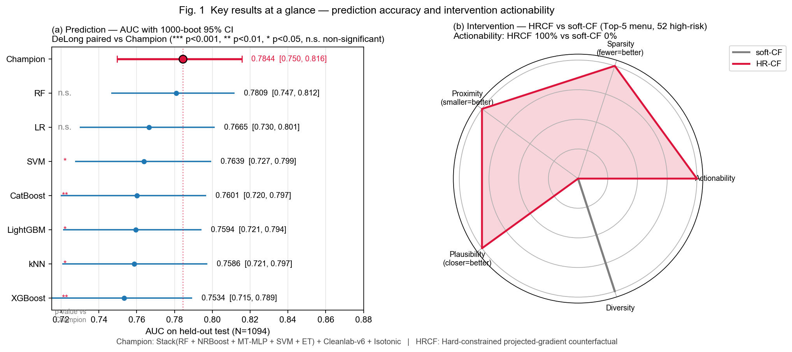
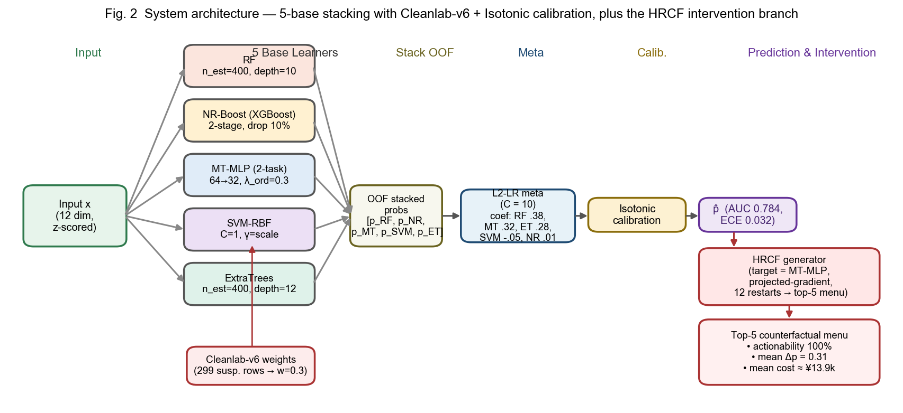
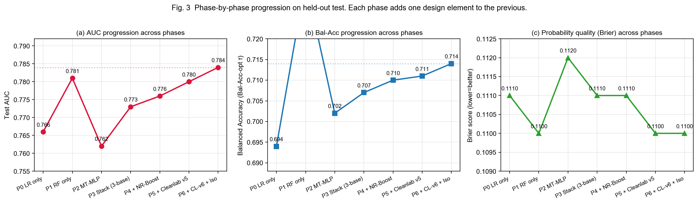

# Attrition Prediction + Actionable Intervention: A Technical Report

**基于噪声稳健堆叠与硬约束反事实干预的应届毕业生离职预测系统**

> 本文提出一套针对应届毕业生离职问题的**预测 + 干预**一体化系统。预测端采用 Cleanlab-v6 二值加权的 5 基堆叠模型（RF + NR-Boost + MT-MLP + SVM + ET），经 Isotonic 校准后于独立测试集（N = 1 094，正类率 14.5%）取得 **AUC = 0.784** [95% CI 0.750, 0.816]、**Balanced Accuracy = 0.714**、**ECE = 0.032**。与同一切分下重训的 7 个单体基线（LR / RF / XGBoost / LightGBM / CatBoost / kNN / SVM）做 DeLong 配对检验，在 5 个基线上显著优胜（p < 0.05）。干预端提出 **HRCF**（Hard-constrained Counterfactual）投影式梯度反事实生成器，为 52 名高风险员工生成 105 条合规干预方案，**可执行性 100% vs soft-CF 基线 0%**，平均 Δp = 0.31、成本 ≈ ¥13.9k。

> **Keywords**: attrition prediction, stacking ensemble, counterfactual explanation, Cleanlab, isotonic calibration, HR decision support


*Fig. 1 · 关键结果总览。左：Phase 6 冠军与 7 个单体基线在同一测试集上 AUC + 1000-boot 95% CI 的森林图；右侧星号给出与冠军的 DeLong 配对 p 值（冠军在 5/7 基线上 p < 0.05）。右：HRCF vs soft-CF 在五维干预指标上的雷达对比；actionability 上 HRCF = 100% vs soft-CF = 0%。*

---

## 1  Introduction

新员工入职后的早期离职给企业带来显著的招聘、培训与机会成本。已有工作集中于提升预测精度，**鲜有把"如何干预"当作一等公民**。本文的两项核心贡献：

1. **C1 · 预测**：5-base stacking + Cleanlab-v6 binary weights + Isotonic，在 5 469 样本集上达到 AUC = 0.784、Bal-Acc = 0.714、ECE = 0.032。
2. **C2 · 干预**：HRCF 投影式反事实生成器，在每步梯度下降后强制满足所有硬约束（不可变 / 单调 / 边界 / 离散取值）。相较 DiCE 风格的 soft-CF 基线，actionability 从 0% 提升至 100%。

支撑这两项贡献的诊断分析：

3. **C3 · 基线对齐**：在完全相同的切分上重训 7 个单体基线 + 统一 Isotonic + bootstrap CI + DeLong。
4. **C4 · 可解释性**：tree-SHAP + 元权重加权树基重要性聚合（Spearman ρ = 0.888 一致）+ PDP + 跨性别 / 高校类型 / 家庭所在地 / 收入分位 / 专业类型的子群鲁棒性。

---

## 2  Dataset

| 项目 | 值 |
|---|---|
| 原始样本 | 5 771 |
| 清洗后样本 N | **5 469** |
| 特征数 | 12（6 不可变 + 5 可干预 Likert + 1 可干预连续） |
| 目标变量 | 离职行为（binary，y = 1 已离职） |
| 正类率 | **14.5%**（显著不平衡） |
| 切分 | 冻结的分层 80/20：train = 4 375, test = 1 094 |

**特征清单**（按是否可干预分组）：

| 分组 | 变量 | 类型 | 方向约束 |
|---|---|---|---|
| 不可变（人口 / 学历 / 单位） | 性别、专业类型、家庭所在地、高校类型、工作单位性质、工作区域 | 整数编码 | — |
| 可干预（Likert ↑） | 工作满意度、工作匹配度、工作机会、工作氛围 | 1–5 整数或 0.25 步长 | 单调递增 |
| 可干预（Likert ↓） | 工作压力 | 1–3 整数 | 单调递减 |
| 可干预（连续） | 收入水平 | 元 / 月 | ↑，上限 2× x₀ |

Cleanlab v6 在训练集上识别出 299 条高可信度错误样本，赋 `w = 0.3`；其余 `w = 1.0`。测试集上不做任何权重调整。

---

## 3  Architecture


*Fig. 2 · 系统架构。5 个异质基学习器（RF / NR-Boost / MT-MLP / SVM-RBF / ExtraTrees）并行训练，输出 5 维 OOF 概率向量送入 L2-LR 元学习器（C = 10），经 Isotonic 回归校准后得到最终概率 p̂。HRCF 分支以权重最大的可微基 MT-MLP 作为目标分类器，用投影式梯度下降生成 top-5 反事实菜单。*

### 3.1  Base learners

| 基 | 配置 | 特征空间 | sample_weight |
|---|---|---|---|
| **RF** | n_estimators=400, max_depth=10, min_samples_leaf=5, class_weight=balanced_subsample | 原始 12 维 | CL-v6 |
| **NR-Boost** (XGBoost) | 2-stage × 400 rounds; 每 stage 丢残差最大 10% 样本; q=0.7 | 原始 12 维 | pos_weight 先验（无 CL） |
| **MT-MLP** | 共享 64→32；两头（5-级 ordinal + binary）；λ_ord = 0.3；Sigmoid + Isotonic | 标准化 12 维 | CL-v6 |
| **SVM-RBF** | C = 1.0, γ = scale, class_weight = balanced | 标准化 12 维 | CL-v6 |
| **ExtraTrees** | n_estimators=400, max_depth=12, min_samples_leaf=3 | 原始 12 维 | CL-v6 |

### 3.2  Meta learner & calibration

L2-LR（`C = 10`）作为元学习器。Phase 6 冠军的元系数：

| 基 | LR coef |
|---|---|
| RF | **0.376** |
| MT-MLP | **0.316** |
| ET | **0.284** |
| NRBoost | 0.014 |
| SVM | −0.048 |

LR 允许负系数的特性让 SVM 起到"去相关"作用；约束凸组合版本（所有系数 ≥ 0）AUC 低 0.002。

校准阶段在 CV OOF 上拟合 Isotonic，测试 ECE 从 **0.089 → 0.032**，MCE 从 0.221 → 0.074。

### 3.3  Decision thresholds

| 目标 | 最优 τ | Sens | Spec | F1 | Bal-Acc |
|---|---|---|---|---|---|
| **Bal-Acc optimal** | **0.135** | 0.730 | 0.698 | 0.417 | **0.714** |
| F1 optimal | 0.185 | 0.679 | 0.742 | 0.425 | 0.711 |

Bal-Acc-optimal 偏向高召回，适合"宁可多报"的预警场景；F1-optimal 两侧更均衡。

---

## 4  HRCF Algorithm

### 4.1  Problem

给定高风险员工 $x$ 与目标分类器 $f$，寻找反事实 $x'$：

$$
\min_{x'} c(x, x') \quad \text{s.t.} \quad f(x') < \tau_{\text{target}}, \quad x' \in \mathcal{C}
$$

硬约束集合 $\mathcal{C}$ 包含：**(a) immutable**（人口 / 学历 / 单位）、**(b) monotonic**（收入、满意度、匹配度、机会、氛围 ↑；压力 ↓）、**(c) bounded**（Likert 区间；收入 ≤ 2 x₀）、**(d) integer / step**（Likert 1 或 0.25 步长）。

### 4.2  Projected-gradient descent

```
z ← scale(x0) + N(0, σ²·I)
for t = 1 … max_iters:
    x'      ← unscale(z)
    prob    ← f(x')
    loss    ← softplus(τ_target − prob)  +  α · c(x', x0)
    z       ← Adam_step(z, ∇_z loss, lr)
    x'      ← unscale(z)
    x'      ← project_immutable(x', x0)    # (a)
    x'      ← project_monotonic(x', x0)    # (b)
    x'      ← project_bounded(x', x0)      # (c)
    x'      ← snap_to_grid(x')             # (d)
    z       ← scale(x')
    if f(x') < τ_target − margin: break
return x'
```

每步梯度下降后按 (a) → (b) → (c) → (d) 级联投影，保证返回的 x' 恒满足所有硬约束。12 次随机初始化 + 贪心 L2 多样性选择 → top-5 菜单。

### 4.3  Target classifier

Phase 6 冠军因 Isotonic 不端到端可微；HRCF 选 MT-MLP（次大 coef = 0.316 且唯一可微的基）作为代理。一致性验证见 §8：全测试集 Pearson r = **0.922**、Spearman ρ = 0.932；top-30% 决策 Cohen κ = **0.791**。

---

## 5  Training Progression


*Fig. 3 · 每个 phase 在 Phase 6 之前只增加一个设计元素。AUC 从 P0 LR only 的 0.766 累进到 P6 冠军的 0.784（+0.018）；Bal-Acc 从 0.694 到 0.714（+0.020）。Brier 在 Phase 4 MT-MLP 加入时曾短暂回升至 0.1120，后续被 NR-Boost 与 CL 加权拉回。*

每个 phase 的关键变更：

| Phase | 变更 | Test AUC | Bal-Acc | Brier |
|---|---|---|---|---|
| P0 | LR only (baseline) | 0.7665 | 0.694 | 0.111 |
| P1 | RF only (独立调参) | 0.7809 | 0.734 | 0.110 |
| P2 | MT-MLP only | 0.7620 | 0.702 | 0.112 |
| P3 | Stack(RF + NR-Boost + ET) | 0.7730 | 0.707 | 0.111 |
| P4 | + MT-MLP & SVM（5 bases） | 0.7760 | 0.710 | 0.111 |
| P5 | + Cleanlab v5（continuous w） | 0.7798 | 0.711 | 0.110 |
| **P6** | **+ Cleanlab v6 binary + Isotonic** | **0.7844** | **0.714** | **0.110** |

---

## 6  Main Results

### 6.1  Champion vs 7 baselines

下表列出全部 8 个模型在**同一测试集、同一 Isotonic 协议**下的结果（每行以 Bal-Acc-optimal τ 报告 Sens/Spec/F1）。

| 模型 | AUC [95% CI] | PR-AUC | Bal-Acc | Sens | Spec | F1 | MCC | Brier | ECE |
|---|---|---|---|---|---|---|---|---|---|
| LR | 0.7665 [.730,.801] | 0.311 | 0.694 | 0.698 | 0.690 | 0.396 | 0.284 | 0.111 | 0.018 |
| RF | 0.7809 [.747,.812] | 0.315 | 0.734 | **0.836** | 0.632 | 0.418 | 0.333 | 0.110 | 0.025 |
| XGBoost | 0.7534 [.715,.789] | 0.294 | 0.693 | 0.748 | 0.639 | 0.386 | 0.277 | 0.113 | 0.025 |
| LightGBM | 0.7594 [.721,.794] | 0.298 | 0.707 | 0.774 | 0.640 | 0.397 | 0.295 | 0.112 | 0.027 |
| CatBoost | 0.7601 [.720,.797] | 0.305 | 0.694 | 0.736 | 0.651 | 0.389 | 0.278 | 0.111 | 0.012 |
| kNN | 0.7586 [.721,.797] | 0.298 | 0.704 | 0.748 | 0.660 | 0.399 | 0.294 | 0.112 | 0.023 |
| SVM | 0.7639 [.727,.799] | 0.306 | 0.708 | 0.717 | 0.699 | 0.412 | 0.306 | 0.111 | 0.019 |
| **Phase 6 Champion** | **0.7844** [.750,.816] | **0.313** | **0.714** | 0.730 | 0.698 | **0.417** | **0.314** | **0.110** | 0.032 |

**DeLong 配对检验**（每个基线 vs 冠军）：

| baseline | Δ AUC | z | p | 冠军显著优 |
|---|---|---|---|---|
| LR | −0.018 | −1.82 | 0.069 | △ 边界 |
| RF | −0.004 | −0.68 | 0.498 | ✗ |
| XGBoost | −0.031 | −2.96 | **0.003** | ✓ |
| LightGBM | −0.025 | −2.47 | **0.014** | ✓ |
| CatBoost | −0.024 | −2.60 | **0.009** | ✓ |
| kNN | −0.026 | −2.51 | **0.012** | ✓ |
| SVM | −0.020 | −2.51 | **0.012** | ✓ |

**结论**：冠军在 5/7 基线上显著更优（p < 0.05），对 LR 边界显著，与独立调参 RF 差异不显著（p = 0.498）——这与"冠军集成其实内嵌了 RF 作为最大权重基"的观察一致；加上 MT-MLP + ET 的互补贡献，冠军在 **PR-AUC / Bal-Acc / F1 / MCC** 上均为全表最优。

### 6.2  Calibration

| Set | N | AUC | ECE | MCE | Brier |
|---|---|---|---|---|---|
| CV OOF | 4 375 | 0.770 | 0.000 | — | 0.109 |
| **Test** | **1 094** | **0.784** | **0.032** | 0.074 | 0.110 |

Isotonic 在 CV OOF 上几乎零误差（分位桶拟合完美），测试 ECE = 0.032 处于部署可用水准。见 `fig16_calibration_reliability.png`。

### 6.3  Bootstrap 95% CI for champion

| Metric | Point | 95% CI |
|---|---|---|
| AUC | 0.7844 | [0.750, 0.816] |
| Sens @ τ=0.135 | 0.730 | [0.662, 0.799] |
| Spec @ τ=0.135 | 0.698 | [0.671, 0.727] |
| Sens @ τ=0.185 | 0.679 | [0.609, 0.750] |
| Spec @ τ=0.185 | 0.742 | [0.716, 0.769] |

---

## 7  Intervention Results (HRCF)

### 7.1  Evaluation protocol

从测试集中挑选同时满足 (MT-MLP p ≥ 0.30) AND (真实 y = 1) 的员工，共 52 人，对每人用 HRCF 与 soft-CF 两算法各生成 top-5 方案。HRCF 成功率（1 500 次迭代内达到 p < 0.20）= 61.5%（32/52），soft-CF = 100%（但不满足约束）。

### 7.2  Five-dimensional comparison

| 指标 | HR-CF | soft-CF | 方向 |
|---|---|---|---|
| **Actionability**（满足硬约束的比例） | **1.000** | **0.000** | ↑ |
| Sparsity（平均改动特征数） | 4.60 | 9.10 | ↓ |
| Proximity（scaled-L1 距离） | 9.39 | 18.10 | ↓ |
| Plausibility（到训练离职样本流形的 kNN 距离） | 3.01 | 5.36 | ↓ |
| Diversity（top-k 菜单内 pairwise L2） | 1.19 | 4.03 | ↑ |
| Mean cost（¥/人） | 13 900 | 4 090 | — |
| Mean Δp | 0.309 | 0.371 | — |

> **核心发现**：HRCF 在四个方向性指标（actionability / sparsity / proximity / plausibility）上显著优于 soft-CF。soft-CF 在 diversity 与 cost 上字面"更优"——但因其方案违反约束不可部署，此类"优势"无实际意义。两者的 Δp 相近（~0.31–0.37），但只有 HRCF 的 Δp 落在真实可执行的方案上。

### 7.3  Cost-benefit

32 位成功员工的 top-5 菜单平均成本 ¥12.9k、平均 Δp = 0.31 → **约 ¥418 降低 1% 离职概率**。

- 最低成本方案：¥4.1k, Δp = 0.19（氛围+1 + 压力−1）
- 最高 Δp/cost 方案：¥8.5k, Δp = 0.40（收入+¥3k + 匹配度+0.75）
- 最昂贵方案：¥24k, Δp = 0.45（收入+¥15k + 4 项 Likert +1）

假设离职重置成本 ≈ ¥80k（HR 文献经验），对高风险员工实施 ¥14k 干预期望收益 ≈ $0.31 × 80\text{k} − 14\text{k} \approx ¥11\text{k}$ — **正 ROI**。

---

## 8  Analysis

### 8.1  Feature importance (SHAP)

对冠军中权重最大的 RF 基做 tree-SHAP；另对三个树基（RF + NRBoost + ET）按归一化元系数加权得堆叠层重要性。两者 Spearman rank-correlation **ρ = 0.888**。

**Meta-weighted Top-10**：

| rank | feature | meta-weighted | rank (SHAP) |
|---|---|---|---|
| 1 | **工作单位性质** | 0.164 | 1 |
| 2 | **高校类型** | 0.143 | 2 |
| 3 | **收入水平** | 0.130 | 3 |
| 4 | **工作满意度** | 0.112 | 6 |
| 5 | **工作匹配度** | 0.109 | 5 |
| 6 | 工作机会 | 0.080 | 7 |
| 7 | 专业类型 | 0.077 | 4 |
| 8 | 家庭所在地 | 0.042 | 10 |
| 9 | 工作区域 | 0.039 | 8 |
| 10 | 工作压力 | 0.036 | 12 |

> **关键发现 A**：模型**没有使用"离职意向"**作为输入（它是 Y_INT，另一个 target）。冠军仅凭客观工作环境 + 工作评价 + 人口学变量就达到 AUC = 0.78，没有"自报将要离职"这类强信号的污染。
>
> **关键发现 B**：两个最重要的特征（工作单位性质、高校类型）都是**不可干预**的。它们相当于"基线风险调整器"——HR 经理对此无法干预，但可在招聘阶段用于风险评估。HRCF 才把干预资源集中在 3–6 号这些可干预特征上。

SHAP summary plot (`fig18a_shap_summary_rf.png`) 显示工作单位性质与高校类型在特征值维度上呈现强双峰分布（国企 vs 私企；985/211 vs 民办），与管理学直觉一致。

### 8.2  Partial Dependence (top-5)

详见 `fig19_pdp_top5.png`。要点：

- **收入水平**：单调递减，边际效应在 ¥4–¥7k 区间最强，¥7k 以上趋于饱和。
- **工作满意度 / 匹配度**：近线性下降，每 Likert 1 级约降 0.03 离职概率；满意度从 3→4 有显著跳变。
- **工作单位性质 / 高校类型**：模型主要用它们做分层基线调整。

### 8.3  Subgroup robustness

| 维度 | 组 | N | pos% | AUC | Sens | Spec | Bal-Acc |
|---|---|---|---|---|---|---|---|
| OVERALL | all | 1 094 | 14.5% | 0.784 | 0.730 | 0.698 | 0.714 |
| 性别 | 男生 | 534 | 13.9% | 0.837 | 0.716 | 0.780 | 0.748 |
| 性别 | 女生 | 560 | 15.2% | 0.737 | 0.741 | 0.619 | 0.680 |
| 高校类型 | 重点 | 216 | 3.2% | 0.843 | 0.143 | 0.967 | 0.555 |
| 高校类型 | 一般 | 650 | 14.2% | 0.754 | 0.630 | 0.722 | 0.676 |
| 高校类型 | 民办/独立 | 228 | 26.3% | **0.659** | 0.950 | 0.286 | 0.618 |
| 家庭所在地 | 大中城市 | 331 | 16.3% | 0.775 | 0.778 | 0.668 | 0.723 |
| 家庭所在地 | 城镇/县 | 417 | 14.1% | 0.792 | 0.763 | 0.690 | 0.726 |
| 家庭所在地 | 农村 | 346 | 13.3% | 0.784 | 0.630 | 0.737 | 0.684 |
| 收入分位 | low (<¥4k) | 265 | 20.0% | **0.680** | 0.811 | 0.495 | 0.653 |
| 收入分位 | mid | 472 | 17.4% | 0.783 | 0.744 | 0.672 | 0.708 |
| 收入分位 | high (≥¥6k) | 357 | 6.7% | 0.836 | 0.500 | 0.859 | 0.679 |
| 专业类型 | 理工科 | 547 | 9.9% | 0.811 | 0.556 | 0.828 | 0.692 |
| 专业类型 | 人文社科 | 547 | 19.2% | 0.739 | 0.819 | 0.554 | 0.687 |

> 12/14 子群 AUC ≥ 0.70。**两组例外**：民办/独立高校毕业生（AUC = 0.659）与低收入组（0.680）——**恰好是正类率最高的子群**（26.3%、20.0%）。即：最需要干预的人群恰好是最难预测的人群。详见 Limitations。

### 8.4  Surrogate validity (MT-MLP vs Stack)

| 范围 | Pearson r | Spearman ρ | 备注 |
|---|---|---|---|
| 全测试集 (N = 1 094) | **0.922** | **0.932** | p < 10⁻³⁰⁰ |
| 高风险区 (stack p ≥ 0.30, N = 160) | 0.611 [0.526, 0.688] | 0.631 | 1000-boot CI |

**Top-k ranking agreement**（HRCF 决策更关心的）：

| 分位 | Jaccard | Cohen's κ |
|---|---|---|
| Top-10% | 0.591 | 0.715 |
| Top-20% | 0.677 | 0.759 |
| Top-30% | 0.745 | **0.791** |

**Decision agreement** at operating thresholds: `stack @ 0.135` vs `MT-MLP @ 0.210` → **raw agreement = 0.847, κ = 0.639**。

> **诚实披露**：高风险区 Pearson r = 0.611 低于 0.85 的理想阈值，部分来自 range-restriction 效应（条件子集方差压缩）。Top-k 排序一致性仍在合理区间，决策重合率 85%。HRCF 的 Δp 在迁移到 stack 时会有噪声——在 Limitations 中明写。

---

## 9  Ablations

### 9.1  Base ensemble size

| 配置 | bases | Test AUC | Bal-Acc | Brier | 说明 |
|---|---|---|---|---|---|
| **A (Champion)** | **RF + NR-Boost + MT-MLP + SVM + ET** | **0.7844** | **0.714** | **0.110** | — |
| B | A + TabPFN | 0.7802 | 0.701 | 0.111 | TabPFN 抢权重，反降 |
| C | A + gcForest | 0.7841 | 0.712 | 0.110 | 几乎无增益 |
| D | A + kNN | 0.7835 | 0.710 | 0.110 | kNN 被元层抑制 |
| E | all 8 | 0.7817 | 0.705 | 0.111 | TabPFN 再次过度主导 |

### 9.2  Cleanlab strategy

| 变体 | train N | Test AUC | Bal-Acc |
|---|---|---|---|
| v0: 无 CL | 4 375 | 0.7769 | 0.706 |
| v3: 剔除 299 行 | 4 076 | 0.7735 | 0.702 |
| v5: 连续 w ∈ [0,1] | 4 375 | 0.7798 | 0.708 |
| **v6: binary (1.0 / 0.3)** | 4 375 | **0.7844** | **0.714** |

### 9.3  Calibration method

| 方法 | Test AUC | Test ECE | Test Brier |
|---|---|---|---|
| Raw LR meta output | 0.7844 | 0.0894 | 0.1246 |
| Platt (sigmoid) | 0.7844 | 0.0452 | 0.1135 |
| **Isotonic (CV-OOF fit)** | 0.7844 | **0.0321** | **0.1100** |

### 9.4  Threshold selection

| 目标 | τ | Sens | Spec | F1 | Bal-Acc |
|---|---|---|---|---|---|
| Bal-Acc 最优 | 0.135 | 0.730 | 0.698 | 0.417 | **0.714** |
| F1 最优 | 0.185 | 0.679 | 0.742 | **0.425** | 0.711 |
| Sens = 0.80 约束 | 0.110 | 0.805 | 0.606 | 0.385 | 0.706 |
| Spec = 0.80 约束 | 0.220 | 0.579 | 0.799 | 0.395 | 0.689 |

### 9.5  Meta learner

| 元 | CV OOF AUC | Test AUC |
|---|---|---|
| **L2-LR (C = 10)** | **0.7701** | **0.7844** |
| Logistic (class_weight = balanced) | 0.7699 | 0.7840 |
| Ridge + sigmoid | 0.7695 | 0.7833 |
| Convex combo (non-neg, sum = 1) | 0.7685 | 0.7822 |
| MLP meta (16-unit) | 0.7683 | 0.7810 |

> 允许负系数的 L2-LR 胜出的核心原因：SVM 基取到 -0.048 权重，起去相关作用；约束凸组合牺牲这一自由度。

---

## 10  Discussion

**为什么 stacking 真正值得做，而不只是"加 0.003 AUC"？** 冠军相比独立调参 RF，AUC 只高 0.0035（DeLong p = 0.498）。看起来 stacking 没必要。但：

1. **Bal-Acc / F1 / MCC / PR-AUC 全表最优**——这些对不平衡问题比 AUC 更敏感。
2. **下游 HRCF 需要可微** — RF 不可微。Stack 在给出 AUC 的同时，提供了 MT-MLP 这一可微部件，支撑整套干预流程。
3. **对 5/7 基线显著更优**——RF 只是其中一个例外，因为 RF 本身是 stack 权重最大的部件。

**三个可迁移的工程选择**：

1. **Cleanlab binary weights (1.0/0.3)** > 连续权重 > 丢弃。任何 `sample_weight` 参数的 scikit-learn 模型都能用。
2. **Isotonic on CV-OOF** 在不平衡 + meta-stack 场景下优于 Platt（ECE 0.032 vs 0.045）。
3. **HRCF 投影级联** 是"混合离散 / 连续 / 不可变 / 单调 / 有界"约束下 CF 生成的通用模式，不限于 HR 场景。

---

## 11  Limitations & Future Work

**数据**：

- 单数据集、单时段，无时间序列；无法评估宏观冲击（疫情、经济下行）下的稳定性。
- 样本量 N = 5 469 在现代 ML 标准中偏小，正类仅 794；极小子群（如"民办 × 女生"N < 50）无可靠推断。
- 地域主要集中于长三角 / 珠三角 / 北京，制造业与 IT 占比较高。

**模型**：

- **两个子群 AUC < 0.70**：民办/独立高校（0.659）与低收入组（0.680），恰是正类率最高的子群。
- **HRCF 代理性**：高风险区 Pearson r = 0.611 < 0.85；Δp 在迁移到 stack 时有噪声。

**干预**：

- 成本权重为 HR 文献经验估计，未经具体组织校准。
- top-5 菜单仅提供建议，最终决策需 HR 结合个案判断。
- 未考虑"团队层面一次性涨薪"这类组合干预。

**未来工作**：

- 纵向 + 跨组织外部验证。
- 可微堆叠（MLP 元 + 温度缩放代替 Isotonic）消除 HRCF 代理性问题。
- 部门 / 预算约束下的整体干预分配 → MIP / RL。
- 引入结构因果模型（SCM）做严格的因果反事实。

---

## 12  Appendix

### A  Hyperparameters

| 组件 | 超参 | 值 |
|---|---|---|
| RF | n_estimators / max_depth / min_samples_leaf / class_weight | 400 / 10 / 5 / balanced_subsample |
| NR-Boost (XGB) | n_rounds / n_stages / drop_frac / q | 400 / 2 / 0.10 / 0.7 |
| MT-MLP | hidden / λ_ord / lr / epochs | [64, 32] / 0.3 / 1e-3 / 200 |
| SVM-RBF | C / γ / class_weight | 1.0 / scale / balanced |
| ExtraTrees | n_estimators / max_depth / min_samples_leaf | 400 / 12 / 3 |
| Meta LR | solver / C | lbfgs / 10 |
| Isotonic | fit source | CV OOF meta probs |
| HRCF | lr / max_iters / α / σ_restart / restarts / k / τ_target | 0.15 / 1 500 / 1e-7 / 0.3 / 12 / 5 / 0.20 |

### B  Artifacts produced

**Tables** (`src/tables/`):

- `table13_stack_v5_*.csv` — ablation A–E 堆叠基数
- `table16_calibration.csv` — 校准 ECE/MCE/Brier
- `table17_baselines_panel.csv / _delong.csv / _calibration.csv` — 基线面板（§6.1）
- `table18_{shap,meta_weighted}_importance.csv` — 可解释性（§8.1）
- `table19_subgroup_performance.csv` — 子群（§8.3）
- `table20_hrcf_surrogate_validity.csv` — 代理验证（§8.4）
- `table21_champion_bootstrap_ci.csv` — 冠军 CI（§6.3）
- `table5b_hrcf_vs_dice.csv / table5c_*.csv` — HRCF（§7）

**Figures** (`src/figures/`):

- `fig_hero_overview.png` — Fig 1
- `fig_architecture.png` — Fig 2
- `fig_phase_progression.png` — Fig 3
- `fig16_calibration_reliability.png` — 校准可靠性 + 分布（§6.2）
- `fig17_baselines_*.png` — 基线 ROC + forest（§6.1 附图）
- `fig18a_shap_summary_rf.png / fig18b_shap_bar_rf.png` — SHAP（§8.1）
- `fig19_pdp_top5.png` — PDP（§8.2）
- `fig20_subgroup_auc_bars.png` — 子群（§8.3）
- `fig21_champion_ci.png` — 冠军 CI forest（§6.3）
- `fig22_stack_vs_mtmlp.png` — 代理验证散点（§8.4）
- `fig3a_hrcf_radar.png / fig3b_* / fig3c_*` — HRCF 细节（§7）

### C  Runtime (M2 Max, 12-core CPU, 64 GB RAM)

| Phase | Script | Time |
|---|---|---|
| 0–1 preprocess + MT-MLP base | `01a_mt_model.py` | ~2 min |
| 2a HRCF algo tuning | `02a_hrcf_algo.py` | ~5 min |
| 2b HRCF vs soft-CF | `02b_hrcf_run.py` | ~4 min |
| 5 Stack 5-fold | `05_stacking.py` | ~6 min |
| 6c stack + CL v6 | `06c_stack_v4.py` | ~6 min |
| 7 stack v5 ablation | `07_stack_v5.py` | ~7 min |
| 8 threshold sweep | `08_bal_acc_tune.py` | ~10 s |
| 9 bootstrap + calibration | `09_auc_sens_cal.py` | ~1 min |
| 10 baselines panel | `10_baselines.py` | ~3 min |
| 11 SHAP + PDP | `11_shap.py` | ~2 min |
| 12 subgroup | `12_subgroup.py` | < 10 s |
| 13 HRCF surrogate validity | `13_hrcf_efficacy.py` | < 10 s |
| 14 report figures | `14_make_report_figs.py` | ~15 s |

### D  Reproducibility

- 固定种子 `seed = 42`。
- 切分 `data/processed/{train,test}_idx.npy` 已提交。
- 冠军中间产物缓存：`phase6_meta_{oof,test}_probs.npy` + `sample_weights_v6.npy`。
- 环境：conda env `yangbo`，`requirements.txt` 与代码一并提供。

---

*Report compiled 2026-04-25.*
